<div id="splash">
    <div id="project">
          <span class="splash-title">
               Project
          </span>
          <br />
          <span id="project-value">
               Sigma Comittee
          </span>
    </div>
     <div id="details">
          <div id="left">
               <span class="splash-title">
                    Client
               </span>
               <br />
               <span class="details-value">
                    Indexed Finance
               </span>
               <br />
               <span class="splash-title">
                    Date
               </span>
               <br />
               <span class="details-value">
                    February 2021
               </span>
          </div>
          <div id="right">
               <span class="splash-title">
                    Reviewers
               </span>
               <br />
               <span class="details-value">
                    Daniel Luca
               </span><br />
               <span class="contact">@cleanunicorn</span>
               <br />
               <span class="details-value">
                    Andrei Simion
               </span><br />
               <span class="contact">@andreiashu</span>
          </div>
    </div>
</div>

## Table of Contents
 - [Details](#details)
 - [Issues Summary](#issues-summary)
 - [Executive summary](#executive-summary)
     - [Day 1](#day-1)
     - [Day 2](#day-2)
     - [Day 3](#day-3)
 - [Scope](#scope)
 - [Trust model](#trust-model)
     - [Target execution](#target-execution)
     - [User Interface](#user-interface)
 - [Issues](#issues)
     - [[CommitteeTimelock] - Emits event even if the transaction was already queued](#committeetimelock---emits-event-even-if-the-transaction-was-already-queued)
     - [[CommitteeTimelock] - Can omit the events from the contract implementation](#committeetimelock---can-omit-the-events-from-the-contract-implementation)
     - [[CommitteeTimelock] - The computed txHash should not be considered unique for an execution](#committeetimelock---the-computed-txhash-should-not-be-considered-unique-for-an-execution)
     - [The voting period is shorter than 3 days](#the-voting-period-is-shorter-than-3-days)
     - [[CommitteeTimelock] - update require err message to reflect condition](#committeetimelock---update-require-err-message-to-reflect-condition)
 - [Artifacts](#artifacts)
     - [UML Diagram](#uml-diagram)
     - [Surya](#surya)
     - [Tests](#tests)
 - [License](#license)


## Details

- **Client** Indexed Finance
- **Date** February 2021
- **Lead reviewer** Daniel Luca (@cleanunicorn)
- **Reviewers** Daniel Luca (@cleanunicorn), Andrei Simion (@andreiashu)
- **Repository**: [Sigma Comittee](https://github.com/indexed-finance/sigma-core)
- **Commit hash** `e3b2bed80e1c467b04d1d6121c06ddfc2e751fb6`
- **Technologies**
  - Solidity
  - Node.JS

## Issues Summary

| SEVERITY       |    OPEN    |    CLOSED    |
|----------------|:----------:|:------------:|
|  Informational  |  3  |  0  |
|  Minor  |  2  |  0  |
|  Medium  |  0  |  0  |
|  Major  |  0  |  0  |

## Executive summary

This report represents the results of the engagement with **Indexed Finance** to review **Sigma Comittee**.

The review was conducted over the course of **3 days** on **February 11, 2021**. A total of **5 person-days** were spent reviewing the code.

### Day 1

We started by going through the [initially provided document][Code changes summary] created by the client to have an initial idea about the recent changes.

We also set up a kickoff call with the client [which was recorded][kickoff call] to go through the general idea of the feature, the setup and the architecture of the system.

We continued to review the code, while creating an overview of the architecture to help us have a better understanding of the whole trust model.

### Day 2

We realised we don't have a complete understanding of the system and how the components are glued together, and we asked the client for an additional overview of the system, specifically how the the contracts will be deployed. We received an additional document detailing the [deployment and ownership strategy][Deplyment strategy].

We also asked for more time than initially estimated because we needed time to process all provided additional documentation.

### Day 3

During the final day of the review, we finalized clarifying any issues we identified, finalized the bulk of the report and set up a meeting with the client to deliver the report.

Recordings:
- [Kickoff call][Kickoff call] password: `C#w%d6CX`
- [Sync #1][Sync #1] password: `TKmx2?9r`

## Scope

Documentation: 
- [Code changes summary][Code changes summary]
- [Forum proposal][Forum proposal]
- [IIP 4: Sigma Pilot Snapshot Proposal][IIP4]
- [IIP 4: Sigma Pilot Thread][IIP4 Thread]
- [Deployment strategy][Deplyment strategy]

The initial review focused on the [Sigma Comittee](https://github.com/indexed-finance/sigma-core) identified by the commit hash `e3b2bed80e1c467b04d1d6121c06ddfc2e751fb6`.

We focused on manually reviewing the codebase, searching for security issues such as, but not limited to re-entrancy problems, transaction ordering, block timestamp dependency, exception handling, call stack depth limitation, integer overflow/underflow, self-destructible contracts, unsecured balance, use of origin, gas costly patterns, architectural problems, code readability.

**Includes:**
- The pull requests described in the document, specifically:
  - [PR #13](https://github.com/indexed-finance/sigma-core/pull/13)
  - [PR #15](https://github.com/indexed-finance/sigma-core/pull/15)
  - [PR #11](https://github.com/indexed-finance/sigma-core/pull/11)
  - [PR #7](https://github.com/indexed-finance/sigma-core/pull/7)
  - [PR #10](https://github.com/indexed-finance/sigma-core/pull/10)

[Code changes summary]: https://hackmd.io/WDQtAVf5Qwe5VfSw03VgAQ "Code changes summary"
[Forum proposal]: https://forum.indexed.finance/t/overview-of-changes-to-smart-contracts/171 "Forum proposal"
[Deplyment strategy]: https://hackmd.io/@d1ll0n/rkEklV4Wd
[Kickoff call]: https://us02web.zoom.us/rec/share/ViV5h5HDjYxWf67tb1wZ6jc6jnNlpGgYWehijbO5sryil6gS1ozus-T_P8d43lI.Jf10udDPfAcjQnoI
[Sync #1]: https://us02web.zoom.us/rec/share/8B34_UCeybBdgPW9qgn9Tj1O-bmES7mLDDgD4ihMuCiwABmKD1Ugt09iesLlc604.ql4AhVJk8dtO5hM6
[IIP4]: https://snapshot.page/#/ndx.eth/proposal/QmbneygJdeXFNzxrtVw7CTZAgLUwPBfxrCBzucefuWC1Q8 "IIP 4: Sigma Pilot"
[IIP4 Thread]: https://forum.indexed.finance/t/iip-4-sigma-pilot/74 "IIP 4: Sigma Pilot Thread"

## Trust model

We identified a few important parts of the system that hold increased trust and are critical to the system's correctness and well behavior.

### Target execution

Executing a transaction assumes the target will behave in a certain way. Even though Ethereum has an immutable contract system, there are ways to change how a contract behaves.

This can be done by:
Changing the contract's execution path by changing a storage slot, an external variable (like a timestamp) or a storage variable included in a separate contract
- Upgrading the contract's implementation to a different bytecode right before the target contract is executed

These are not all the ways the apparent contract execution can be unclear or misleading compared to the actual execution path and behavior.

Because the EVM offers an (almost) Turing-complete environment, it's virtually impossible to list all the ways the contract can trick an inexperienced observer into thinking it will not be malicious.

This, combined with the fact that some of the contracts can be upgradable and transaction reordering is a reality, can trick even the most experienced observer.

This is why there is a lot of trust the user has to put in the executed target and the actors who can upgrade parts of the system.

### User Interface

The voting process is another critical trustworthy part of the system that the users will put trust in. Even though they can verify on-chain that their votes will behave in a certain way, most of the users will not do that and will trust the web interface. This is because it's more complicated and tedious to do your own verifying. Thus, most of the users will trust the information relayed by the web interface.

The web interface inherently becomes a trust point between the system and the users.

The will also be other user interfaces the token holders will need to trust.

## Issues


### [[CommitteeTimelock] - Emits event even if the transaction was already queued](https://github.com/monoceros-alpha/review-indexed-sigmacommittee-2021-02/issues/6)
 

**Description**

To run a transaction, it first needs to be queued by calling `queueTransaction`.


[code/contracts/committee/CommitteeTimelock.sol#L116-L122](https://github.com/monoceros-alpha/review-indexed-sigmacommittee-2021-02/blob/858ff477bdacb4a32e5b1f5e6bac122e25581992/code/contracts/committee/CommitteeTimelock.sol#L116-L122)
```solidity
  function queueTransaction(
    address target,
    uint256 value,
    string memory signature,
    bytes memory data,
    uint256 eta
  ) public override isAdmin returns (bytes32) {
```


The arguments are encoded, and the resulting byte string is hashed as `txHash`.


[code/contracts/committee/CommitteeTimelock.sol#L128](https://github.com/monoceros-alpha/review-indexed-sigmacommittee-2021-02/blob/858ff477bdacb4a32e5b1f5e6bac122e25581992/code/contracts/committee/CommitteeTimelock.sol#L128)
```solidity
    bytes32 txHash = keccak256(abi.encode(target, value, signature, data, eta));
```


The `txHash` is then marked as queued in a `queuedTransactions` mapping.


[code/contracts/committee/CommitteeTimelock.sol#L129](https://github.com/monoceros-alpha/review-indexed-sigmacommittee-2021-02/blob/858ff477bdacb4a32e5b1f5e6bac122e25581992/code/contracts/committee/CommitteeTimelock.sol#L129)
```solidity
    queuedTransactions[txHash] = true;
```


When queuing transactions, the only check relates to the `eta` to ensure enough delay until the transaction can be executed.


[code/contracts/committee/CommitteeTimelock.sol#L123-L126](https://github.com/monoceros-alpha/review-indexed-sigmacommittee-2021-02/blob/858ff477bdacb4a32e5b1f5e6bac122e25581992/code/contracts/committee/CommitteeTimelock.sol#L123-L126)
```solidity
    require(
      eta >= getBlockTimestamp().add(delay),
      "CommitteeTimelock::queueTransaction: Estimated execution block must satisfy delay."
    );
```


At the end of the `queueTransaction` method, an event is emitted with the provided parameters.


[code/contracts/committee/CommitteeTimelock.sol#L131](https://github.com/monoceros-alpha/review-indexed-sigmacommittee-2021-02/blob/858ff477bdacb4a32e5b1f5e6bac122e25581992/code/contracts/committee/CommitteeTimelock.sol#L131)
```solidity
    emit QueueTransaction(txHash, target, value, signature, data, eta);
```


Even if the transaction was already queued, an event would be emitted. Thus, an admin could queue multiple times the same transaction but execute it only once. Each time the transaction is queued, an event is omitted. But only one `ExecuteTransaction` event will be emitted when the transaction is executed.


[code/contracts/committee/CommitteeTimelock.sol#L221](https://github.com/monoceros-alpha/review-indexed-sigmacommittee-2021-02/blob/858ff477bdacb4a32e5b1f5e6bac122e25581992/code/contracts/committee/CommitteeTimelock.sol#L221)
```solidity
    emit ExecuteTransaction(txHash, target, value, signature, data, eta);
```


A web interface could become desynchronized if it reads multiple `QueueTransaction` events but only one matching `ExecuteTransaction` event.

**Recommendation**

Add a check in the method `queueTransaction` to ensure the transaction was not already queued before queueing the transaction.

```solidity
require(queuedTransactions[txHash] == false, "CommitteeTimelock::queueTransaction: Transaction already queued.")
```


---


### [[CommitteeTimelock] - Can omit the events from the contract implementation](https://github.com/monoceros-alpha/review-indexed-sigmacommittee-2021-02/issues/2)
 

**Description**

The `CommitteeTimelock` is defined as an extension of the `ICommitteeTimelock` interface. The interface defines a set of events.


[code/contracts/interfaces/ICommitteeTimelock.sol#L5-L31](https://github.com/monoceros-alpha/review-indexed-sigmacommittee-2021-02/blob/ed374bd8bbd948f78a4661182092c6c0a90baec9/code/contracts/interfaces/ICommitteeTimelock.sol#L5-L31)
```solidity
  event NewAdmin(address indexed newAdmin);
  event NewPendingAdmin(address indexed newPendingAdmin);
  event NewDelay(uint256 indexed newDelay);
  event CancelTransaction(
    bytes32 indexed txHash,
    address indexed target,
    uint256 value,
    string signature,
    bytes data,
    uint256 eta
  );
  event ExecuteTransaction(
    bytes32 indexed txHash,
    address indexed target,
    uint256 value,
    string signature,
    bytes data,
    uint256 eta
  );
  event QueueTransaction(
    bytes32 indexed txHash,
    address indexed target,
    uint256 value,
    string signature,
    bytes data,
    uint256 eta
  );
```


And the `CommitteeTimelock` implementation redefines the same set of events.


[code/contracts/committee/CommitteeTimelock.sol#L21-L47](https://github.com/monoceros-alpha/review-indexed-sigmacommittee-2021-02/blob/ed374bd8bbd948f78a4661182092c6c0a90baec9/code/contracts/committee/CommitteeTimelock.sol#L21-L47)
```solidity
  event NewAdmin(address indexed newAdmin);
  event NewPendingAdmin(address indexed newPendingAdmin);
  event NewDelay(uint256 indexed newDelay);
  event CancelTransaction(
    bytes32 indexed txHash,
    address indexed target,
    uint256 value,
    string signature,
    bytes data,
    uint256 eta
  );
  event ExecuteTransaction(
    bytes32 indexed txHash,
    address indexed target,
    uint256 value,
    string signature,
    bytes data,
    uint256 eta
  );
  event QueueTransaction(
    bytes32 indexed txHash,
    address indexed target,
    uint256 value,
    string signature,
    bytes data,
    uint256 eta
  );
```


This isn't necessary, and the event definition can be omitted in the implementation. This also protects from defining almost the same event with different arguments, or typos.

Solidity allows the definition and the emission of events that share the same name but have a different `topic` and arguments.

i.e.,

```solidity
interface IWithEvent {
    event TheEvent(uint n);
}

contract we is IWithEvent {
    event TheEvent(string n);
    
    function emitEvent() public {
        emit TheEvent(block.number);
        emit TheEvent("something else");
    }
}
```

`emitEvent()` will emit 2 very diffent events.

```json
[
    {
        "from": "0x358AA13c52544ECCEF6B0ADD0f801012ADAD5eE3",
        "topic": "0xd3d703951f7bff25f2e2896e97ba52c506eb73af2e72a1bd8bd2944e596609f8",
        "event": "TheEvent",
        "args": {
            "0": "7",
            "n": "7"
        }
    },
    {
        "from": "0x358AA13c52544ECCEF6B0ADD0f801012ADAD5eE3",
        "topic": "0x5286c814765d3cf19bf3c71af4bd8d4b1b3a7c6e748b608da0d23b4f83801ed4",
        "event": "TheEvent",
        "args": {
            "0": "something else",
            "n": "something else"
        }
    }
]
```

**Recommendation**

Remove the event definition from the `CommitteeTimelock` implementation which should leave you with the events defined in the interface `ICommitteeTimelock`.


---


### [[CommitteeTimelock] - The computed `txHash` should not be considered unique for an execution](https://github.com/monoceros-alpha/review-indexed-sigmacommittee-2021-02/issues/5)
 

**Description**

In the `CommitteeTimelock` contract, an admin or a superUser can queue an execution by calling `queueTransaction`.


[code/contracts/committee/CommitteeTimelock.sol#L116-L122](https://github.com/monoceros-alpha/review-indexed-sigmacommittee-2021-02/blob/858ff477bdacb4a32e5b1f5e6bac122e25581992/code/contracts/committee/CommitteeTimelock.sol#L116-L122)
```solidity
  function queueTransaction(
    address target,
    uint256 value,
    string memory signature,
    bytes memory data,
    uint256 eta
  ) public override isAdmin returns (bytes32) {
```


The arguments are packed together using `abi.encode`, and a `keccak256` is applied on top of the encoding.


[code/contracts/committee/CommitteeTimelock.sol#L128](https://github.com/monoceros-alpha/review-indexed-sigmacommittee-2021-02/blob/858ff477bdacb4a32e5b1f5e6bac122e25581992/code/contracts/committee/CommitteeTimelock.sol#L128)
```solidity
    bytes32 txHash = keccak256(abi.encode(target, value, signature, data, eta));
```


The computed `txHash` is then saved in a mapping named `queuedTransactions`.


[code/contracts/committee/CommitteeTimelock.sol#L67](https://github.com/monoceros-alpha/review-indexed-sigmacommittee-2021-02/blob/858ff477bdacb4a32e5b1f5e6bac122e25581992/code/contracts/committee/CommitteeTimelock.sol#L67)
```solidity
  mapping(bytes32 => bool) public override queuedTransactions;
```


The execution can be run by calling `executeTransaction` and specifying again all of the necessary arguments (previously used to compute `txHash`).


[code/contracts/committee/CommitteeTimelock.sol#L148-L154](https://github.com/monoceros-alpha/review-indexed-sigmacommittee-2021-02/blob/858ff477bdacb4a32e5b1f5e6bac122e25581992/code/contracts/committee/CommitteeTimelock.sol#L148-L154)
```solidity
  function executeTransaction(
    address target,
    uint256 value,
    string memory signature,
    bytes memory data,
    uint256 eta
  ) public payable override isAdmin returns (bytes memory) {
```


If the queued execution passes all checks, it will be run, by internally calling `_executeTransaction`.

The internal method `_executeTransaction` checks if a function signature was provided, and if none exists, it assumes the `bytes memory data` already contains the function selector.


[code/contracts/committee/CommitteeTimelock.sol#L209-L213](https://github.com/monoceros-alpha/review-indexed-sigmacommittee-2021-02/blob/858ff477bdacb4a32e5b1f5e6bac122e25581992/code/contracts/committee/CommitteeTimelock.sol#L209-L213)
```solidity
    if (bytes(signature).length == 0) {
      callData = data;
    } else {
      callData = abi.encodePacked(bytes4(keccak256(bytes(signature))), data);
    }
```


This means that for the same execution, 2 different `txHashes` can exist, one with the `signature` specified, the other one with the signature contained in the `data` argument.

Not only 2 different `txHashes` can exist for the same execution (because the signature can be included in the `data` argument), but also ABI encoding makes it possible to decode multiple different byte arrays to the same arguments. This is possible because but not only:
- ABI encoding is not very strict
- Solidity accepts garbage data after all needed arguments were successfully parsed
- Address arguments are enclosed in 32 bytes, but only 20 bytes are significant, the first 12 bytes are erased when Solidity parses that argument; any bytes within the 12 bytes will change the hash, but not change the execution
- Strings have a length attached but enclosed in 32-byte blocks; any bytes after the specified length are ignored

**Recommendation**

It remains unclear

**[optional] References**


---


### [The voting period is shorter than 3 days](https://github.com/monoceros-alpha/review-indexed-sigmacommittee-2021-02/issues/4)
 

**Description**

The newly elected Sigma Committee will have the ability to assign rewards for liquidity mining on new pools. To do this, any new distribution will have to go through a 7 day timelock - in theory, this gives NDX token holders 2 days to veto a token allocation: 

* Committee timelock has a 7 days execution delay
* GovernorAlpha has a 3 day voting period
* Indexed timelock has a 2 day execution delay

Compared to Indexed and Committee timelocks, which measure time in days, [GovernorAlpha.sol](https://github.com/indexed-finance/governance/blob/7473af351c9c38d12bb3741023b749442ef8d763/contracts/governance/GovernorAlpha.sol#L12-L13) measures time as the number of blocks mined since the start of a vote and assumes a block is mined every 15 seconds:

```solidity
  /// @dev The voting period which will be set after setVotingPeriodAfter has passed.
  uint256 public constant permanentVotingPeriod = 17_280; // ~3 days in blocks (assuming 15s blocks)
```

Currently, we have the following average block times:
* past 12 months: avg 13.11 seconds (range of minimum: 12.83 / maximum: 13.53 seconds)
* past 3 months: avg 13.08 seconds

Taking the past 3 months as a point of reference we get the following figures:


This means that, in reality, NDX token holders currently have 2.6 days or just under 63 hours to pass a vote to veto a token allocation. This difference can confuse and potentially stop some users from acting in time to veto proposals if not properly communicated.

**Recommendation**

It might be worth ensuring that users understand that the voting period is less than 3 days so that they don't miss out on vetoing undesirable proposals.

Alternatively, expressing the time intervals as timestamps will ensure the time intervals are precise and predictable.


---


### [[CommitteeTimelock] - update `require` err message to reflect condition](https://github.com/monoceros-alpha/review-indexed-sigmacommittee-2021-02/issues/1)
 

**Description**

The `require` error message does not mention `superUser` although it's one of the OR conditions in this modifier.


[code/contracts/committee/CommitteeTimelock.sol#L59-L65](https://github.com/monoceros-alpha/review-indexed-sigmacomittee-2021-02/blob/4c772f1edb078db49a4b441fe39e6efa6dc7f653/code/contracts/committee/CommitteeTimelock.sol#L59-L65)
```solidity
  modifier isAdmin {
    require(
      msg.sender == admin || msg.sender == superUser,
      "CommitteeTimelock::isAdmin: Call must come from admin."
    );
    _;
  }
```


**Recommendation**

Update the error message to: `Call must come from admin or superUser.`


---


## Artifacts

### UML Diagram

Generated with [sol2uml](https://github.com/naddison36/sol2uml):

```bash
npm link sol2uml --only=production
sol2uml ./code/contracts
```

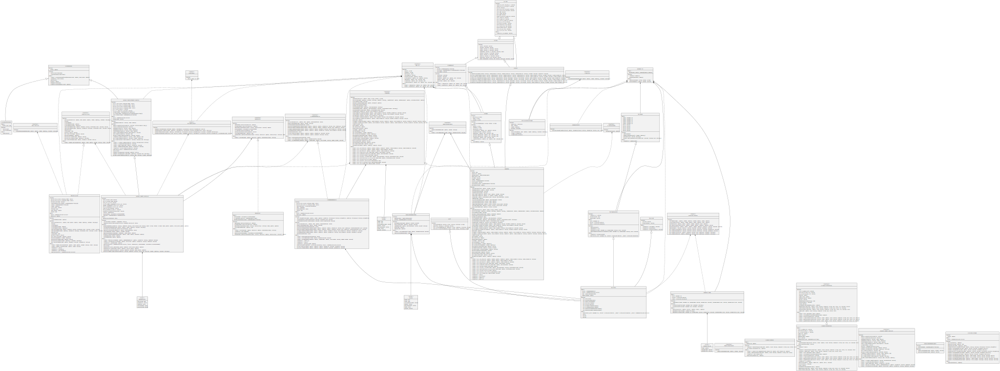

### Surya

Sūrya is a utility tool for smart contract systems. It provides a number of visual outputs and information about the structure of smart contracts. It also supports querying the function call graph in multiple ways to aid in the manual inspection and control flow analysis of contracts.

#### Graphs

##### _CommitteeProxy_

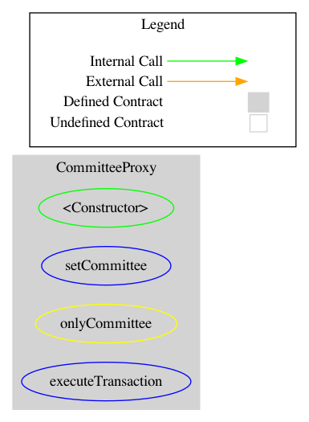

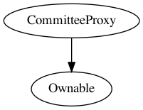


##### _CommitteeTimelock_

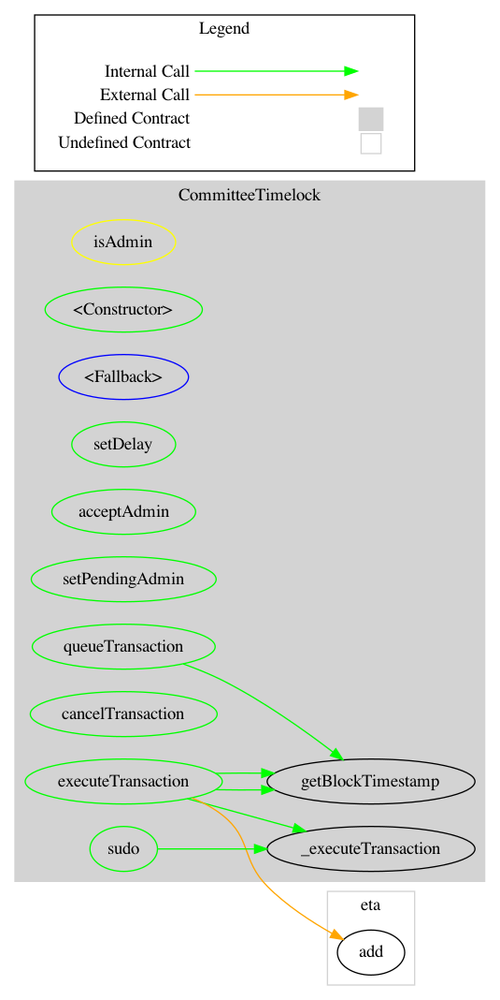

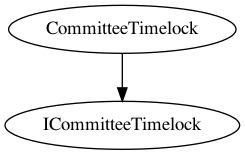


##### _MarketCapSortedTokenCategories_

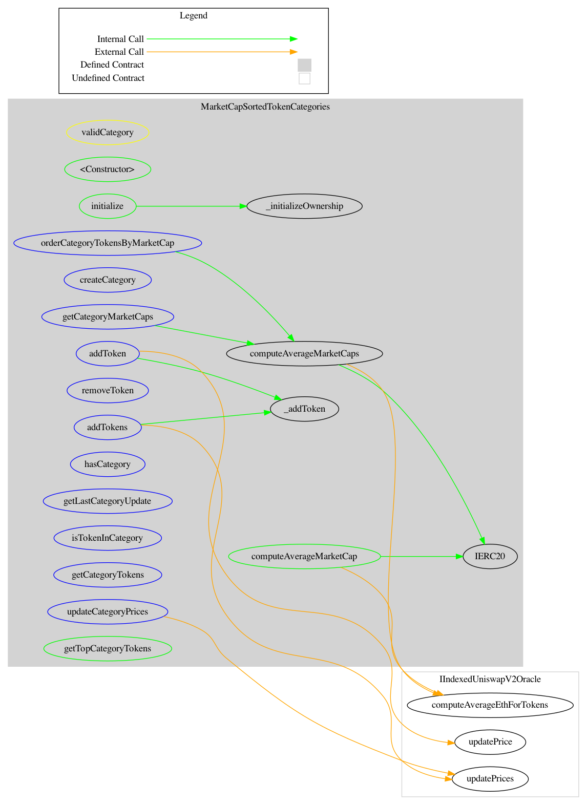

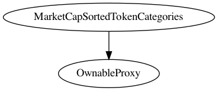


##### _MarketCapSqrtController_

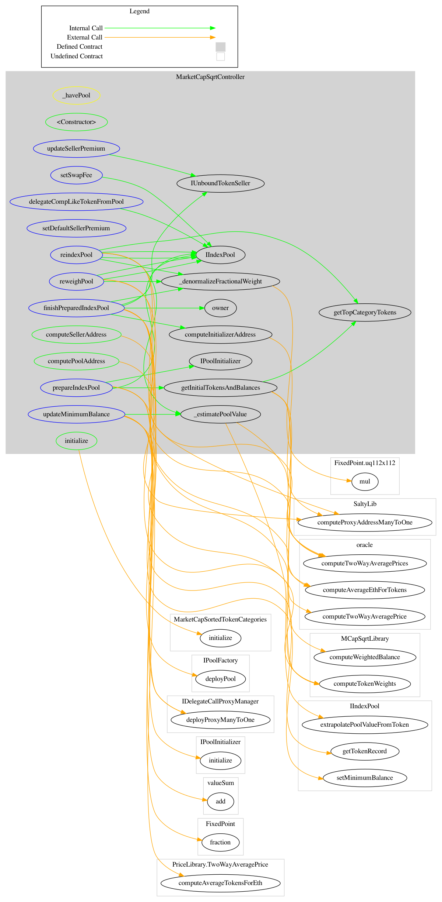

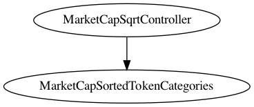


##### _PoolFactory_

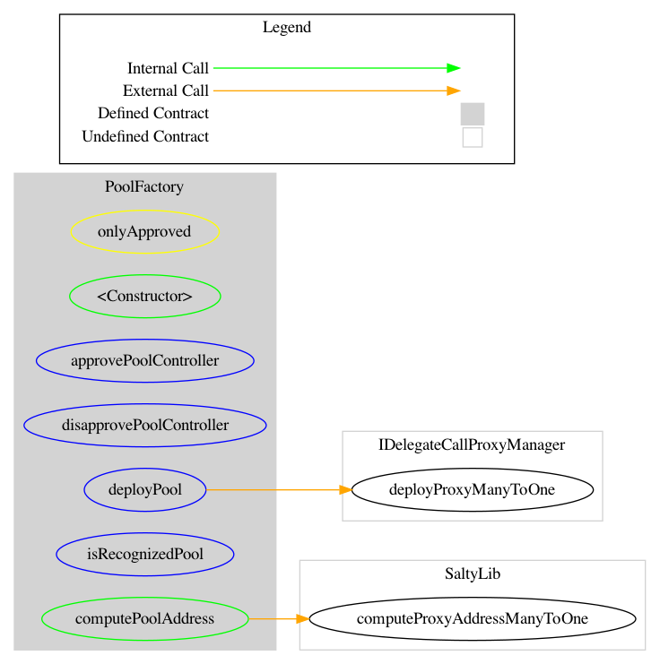

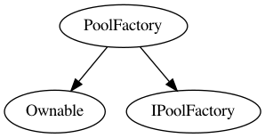


##### _PoolInitializer_

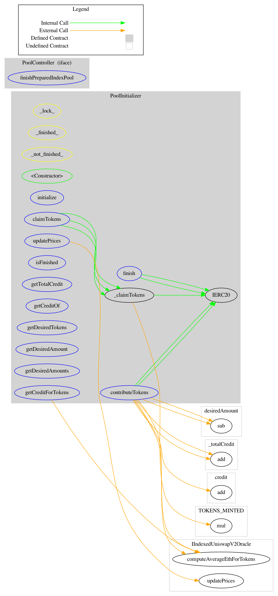

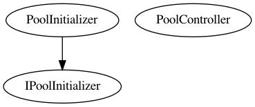


##### _UnboundTokenSeller_

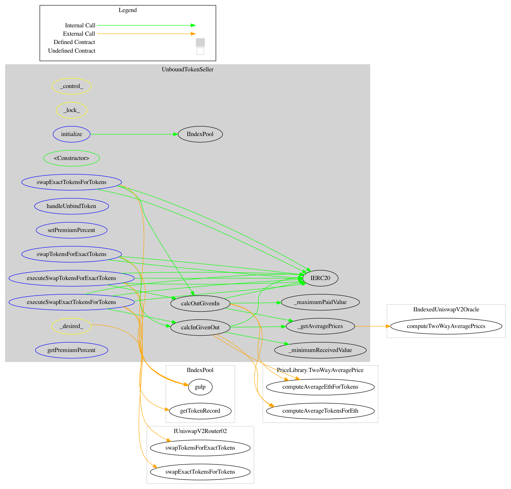

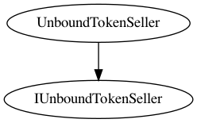


### Tests

We ran tests on node version `v14.8.0` and solidity `0.6.12`. Compiling the contracts resulted in some warnings that are not of concern to the security of the project.

```text
$ node --version
v14.8.0
$ cd code
$ npm run test

> @indexed-finance/indexed-core@1.0.0 test
> buidler test

(node:44972) Warning: Accessing non-existent property 'VERSION' of module exports inside circular dependency
(Use `node --trace-warnings ...` to show where the warning was created)
(node:44972) Warning: Accessing non-existent property 'INVALID_ALT_NUMBER' of module exports inside circular dependency
(node:44972) Warning: Accessing non-existent property 'INVALID_ALT_NUMBER' of module exports inside circular dependency
(node:44972) Warning: Accessing non-existent property 'INVALID_ALT_NUMBER' of module exports inside circular dependency
(node:44972) Warning: Accessing non-existent property 'INVALID_ALT_NUMBER' of module exports inside circular dependency
Compiling...


@uniswap/v2-core/contracts/interfaces/IUniswapV2Factory.sol: Warning: SPDX license identifier not provided in source file. Before publishing, consider adding a comment containing "SPDX-License-Identifier: <SPDX-License>" to each source file. Use "SPDX-License-Identifier: UNLICENSED" for non-open-source code. Please see https://spdx.org for more information.


@uniswap/v2-core/contracts/interfaces/IUniswapV2Pair.sol: Warning: SPDX license identifier not provided in source file. Before publishing, consider adding a comment containing "SPDX-License-Identifier: <SPDX-License>" to each source file. Use "SPDX-License-Identifier: UNLICENSED" for non-open-source code. Please see https://spdx.org for more information.


@uniswap/v2-periphery/contracts/interfaces/IUniswapV2Router01.sol: Warning: SPDX license identifier not provided in source file. Before publishing, consider adding a comment containing "SPDX-License-Identifier: <SPDX-License>" to each source file. Use "SPDX-License-Identifier: UNLICENSED" for non-open-source code. Please see https://spdx.org for more information.


@uniswap/v2-periphery/contracts/interfaces/IUniswapV2Router02.sol: Warning: SPDX license identifier not provided in source file. Before publishing, consider adding a comment containing "SPDX-License-Identifier: <SPDX-License>" to each source file. Use "SPDX-License-Identifier: UNLICENSED" for non-open-source code. Please see https://spdx.org for more information.


contracts/balancer/BMath.sol:119:13: Warning: Only state variables can have a docstring. This will be disallowed in 0.7.0.
    uint256 normalizedWeight = bdiv(tokenWeightIn, totalWeight);
            ^--------------^


contracts/interfaces/ICommitteeTimelock.sol: Warning: SPDX license identifier not provided in source file. Before publishing, consider adding a comment containing "SPDX-License-Identifier: <SPDX-License>" to each source file. Use "SPDX-License-Identifier: UNLICENSED" for non-open-source code. Please see https://spdx.org for more information.


contracts/mocks/LiquidityAdder.sol: Warning: SPDX license identifier not provided in source file. Before publishing, consider adding a comment containing "SPDX-License-Identifier: <SPDX-License>" to each source file. Use "SPDX-License-Identifier: UNLICENSED" for non-open-source code. Please see https://spdx.org for more information.


contracts/mocks/MockBorrower.sol: Warning: SPDX license identifier not provided in source file. Before publishing, consider adding a comment containing "SPDX-License-Identifier: <SPDX-License>" to each source file. Use "SPDX-License-Identifier: UNLICENSED" for non-open-source code. Please see https://spdx.org for more information.


contracts/mocks/MockUnbindSourcePool.sol: Warning: SPDX license identifier not provided in source file. Before publishing, consider adding a comment containing "SPDX-License-Identifier: <SPDX-License>" to each source file. Use "SPDX-License-Identifier: UNLICENSED" for non-open-source code. Please see https://spdx.org for more information.


contracts/mocks/MockUnbindTokenHandler.sol: Warning: SPDX license identifier not provided in source file. Before publishing, consider adding a comment containing "SPDX-License-Identifier: <SPDX-License>" to each source file. Use "SPDX-License-Identifier: UNLICENSED" for non-open-source code. Please see https://spdx.org for more information.


contracts/mocks/OracleFallthrough.sol: Warning: SPDX license identifier not provided in source file. Before publishing, consider adding a comment containing "SPDX-License-Identifier: <SPDX-License>" to each source file. Use "SPDX-License-Identifier: UNLICENSED" for non-open-source code. Please see https://spdx.org for more information.


contracts/mocks/tests/SellerTest.sol: Warning: SPDX license identifier not provided in source file. Before publishing, consider adding a comment containing "SPDX-License-Identifier: <SPDX-License>" to each source file. Use "SPDX-License-Identifier: UNLICENSED" for non-open-source code. Please see https://spdx.org for more information.


contracts/mocks/tests/util/Diff.sol: Warning: SPDX license identifier not provided in source file. Before publishing, consider adding a comment containing "SPDX-License-Identifier: <SPDX-License>" to each source file. Use "SPDX-License-Identifier: UNLICENSED" for non-open-source code. Please see https://spdx.org for more information.


contracts/mocks/tests/util/TestOrder.sol: Warning: SPDX license identifier not provided in source file. Before publishing, consider adding a comment containing "SPDX-License-Identifier: <SPDX-License>" to each source file. Use "SPDX-License-Identifier: UNLICENSED" for non-open-source code. Please see https://spdx.org for more information.


contracts/mocks/tests/util/TestTokenMarkets.sol: Warning: SPDX license identifier not provided in source file. Before publishing, consider adding a comment containing "SPDX-License-Identifier: <SPDX-License>" to each source file. Use "SPDX-License-Identifier: UNLICENSED" for non-open-source code. Please see https://spdx.org for more information.


contracts/mocks/tests/util/TestTokens.sol: Warning: SPDX license identifier not provided in source file. Before publishing, consider adding a comment containing "SPDX-License-Identifier: <SPDX-License>" to each source file. Use "SPDX-License-Identifier: UNLICENSED" for non-open-source code. Please see https://spdx.org for more information.


contracts/committee/CommitteeTimelock.sol:18:1: Warning: This contract has a payable fallback function, but no receive ether function. Consider adding a receive ether function.
contract CommitteeTimelock is ICommitteeTimelock {
^ (Relevant source part starts here and spans across multiple lines).
contracts/committee/CommitteeTimelock.sol:75:3: The payable fallback function is defined here.
  fallback() external payable {}
  ^----------------------------^

Compiled 62 contracts successfully


  CommitteeProxy.sol
    Constructor & Settings
      ✓ committee
      ✓ owner
    setCommittee()
      ✓ Reverts if not called by owner
      ✓ Sets the committee
    executeTransaction()
      ✓ Reverts if not called by committee
      ✓ Executes transaction with function signature (44ms)
      ✓ Executes transaction without function signature (43ms)
      ✓ Reverts if the call fails

  CommitteeTimelock.sol
    Constructor & Settings
      ✓ admin
      ✓ superUser
      ✓ delay
      ✓ GRACE_PERIOD
      ✓ MINIMUM_DELAY (45ms)
      ✓ MAXIMUM_DELAY
    queueTransaction()
      ✓ reverts if not an admin
      ✓ can be called by superUser
      ✓ can be called by admin (41ms)
    executeTransaction()
      ✓ reverts if not an admin
      ✓ reverts if transaction with same txHash not queued
      ✓ reverts if timelock has not passed
      ✓ reverts if tx call fails
      ✓ can execute after the timelock passes (64ms)
    sudo()
      ✓ reverts if not called by superUser
      ✓ reverts if tx call fails (39ms)
      ✓ allows superUser to immediately execute a tx (53ms)

  IndexPool.sol
    Constructor & Settings
      ✓ isPublicSwap()
      ✓ getSwapFee()
      ✓ getController()
      ✓ getExitFeeRecipient()
    setExitFeeRecipient
      ✓ Reverts if not called by current fee recipient
      ✓ Updates the fee recipient
    Control & Public
      ✓ Functions with _control_ role are only callable by controller
      ✓ Functions with _public_ modifier are only callable after initialization (122ms)
    configure(): fail
      ✓ Reverts if controller is already set
      ✓ Reverts if provided controller address is zero (89ms)
    initialize(): fail
      ✓ Reverts if the pool is already initialized
      ✓ Reverts if array lengths do not match (155ms)
      ✓ Reverts if less than 2 tokens are provided
      ✓ Reverts if more than 10 tokens are provided
      ✓ Reverts if any denorm < MIN_WEIGHT
      ✓ Reverts if any denorm > MAX_WEIGHT (47ms)
      ✓ Reverts if any balance < MIN_BALANCE
      ✓ Reverts if total weight > maximum (45ms)
    gulp()
      ✓ Sends unbound tokens to handler
      ✓ Updates balance for bound tokens (44ms)
      ✓ Updates balance for uninitialized tokens (56ms)
      ✓ Initializes token if minimumm balance is hit (40ms)
    setSwapFee()
      ✓ Reverts if caller is not controller
      ✓ Reverts if swapFee < 0.0001%
      ✓ Reverts if swapFee > 10%
      ✓ Sets swap fee between min and max
    setPublicSwap()
      ✓ Freezes public swaps
      ✓ Disables functions with _public
      ✓ Enables public swaps
    setMinimumBalance()
      ✓ Reverts if caller is not controller
      ✓ Reverts if token is not bound
      ✓ Reverts if token is initialized
      ✓ Sets minimum balance of uninitialized token (70ms)
    Token Queries
      ✓ isBound()
      ✓ getNumTokens()
      ✓ getCurrentTokens()
      ✓ getCurrentDesiredTokens() (69ms)
      ✓ getDenormalizedWeight(): success
      ✓ getDenormalizedWeight(): fail
      ✓ getTotalDenormalizedWeight()
      ✓ getBalance(): success
      ✓ getBalance(): reverts if token is not bound
      ✓ getMinimumBalance(): reverts if token is not bound
      ✓ getMinimumBalance(): reverts if token is ready
      ✓ getUsedBalance(): returns actual balance for initialized token
      ✓ getUsedBalance(): returns minimum balance for uninitialized token (74ms)
      ✓ getUsedBalance(): reverts if token is not bound
    getTokenRecord()
      ✓ Returns expected record for bound token
      ✓ Reverts if token is not bound
    extrapolatePoolValueFromToken()
      ✓ Succeeds if any token is ready and desired
      ✓ Reverts if no tokens are both ready and desired
    getSpotPrice()
      ✓ Reverts if either token is unbound
      ✓ Prices initialized tokens normally (56ms)
      ✓ Reverts if tokenOut is not ready (91ms)
      ✓ Uses the minimum balance and weight to price uninitialized tokens
    swapExactAmountIn()
      ✓ Reverts if either token is unbound
      ✓ Reverts if input amount > 1/2 of balance
      ✓ Reverts if spotPriceBefore is lower than maxPrice (67ms)
      ✓ Reverts if spotPriceAfter is lower than maxPrice (170ms)
      ✓ Reverts if tokenAmountOut < minAmountOut (39ms)
      ✓ Prices initialized tokens normally (226ms)
      ✓ Uses the minimum balance and weight to price uninitialized tokens, and uses updated weight for spotPriceAfter (194ms)
      ✓ Reverts if tokenOut is uninitialized (80ms)
    swapExactAmountOut()
      ✓ Reverts if either token is unbound
      ✓ Reverts if output amount > 1/3 of balance
      ✓ Reverts if spot price is lower than maxPrice (44ms)
      ✓ Prices initialized tokens normally (432ms)
      ✓ Uses the minimum balance and weight to price uninitialized tokens, and uses updated weight for spotPriceAfter (190ms)
      ✓ Reverts if tokenOut is uninitialized
    joinswapExternAmountIn()
      ✓ Reverts if tokenAmountIn = 0
      ✓ Reverts if tokenAmountIn > balanceIn / 2
      ✓ Reverts if poolAmountOut < minPoolAmountOut
      ✓ Prices initialized tokens normally
      ✓ Prices uninitialized tokens using minimum balance and weight (97ms)
    joinswapPoolAmountOut()
      ✓ Reverts if tokenAmountIn > balanceIn / 2
      ✓ Reverts if tokenAmountIn > maxAmountIn
      ✓ Prices initialized tokens normally (57ms)
      ✓ Prices uninitialized tokens using minimum balance and weight (115ms)
    joinPool()
      ✓ Reverts if invalid array length is given
      ✓ Reverts if zero tokens are requested
      ✓ Reverts if tokenAmountIn > maxAmountIn
      ✓ Prices initialized tokens normally (111ms)
      ✓ Prices uninitialized tokens using minimum balance and weight (232ms)
    exitswapPoolAmountIn()
      ✓ Prices initialized tokens normally (61ms)
      ✓ Reverts if unbound token is given
      ✓ Reverts if tokenAmountOut < minAmountOut
      ✓ Reverts if tokenAmountOut > balanceOut / 3 (60ms)
      ✓ Reverts if uninitialized token is given (79ms)
    exitswapExternAmountOut()
      ✓ Prices initialized tokens normally (167ms)
      ✓ Reverts if unbound token is given
      ✓ Reverts if poolRatio = 0
      ✓ Reverts if poolAmountIn > maxPoolAmountIn (43ms)
      ✓ Reverts if tokenAmountOut > balanceOut / 3
      ✓ Reverts if uninitialized token is given (61ms)
    exitPool()
      ✓ Prices initialized tokens normally (60ms)
      ✓ Reverts if poolRatio = 0
      ✓ Reverts if invalid array length is given
      ✓ Reverts if tokenAmountOut < minAmountOut
      ✓ Reverts if minAmountOut is not zero for uninitialized tokens (109ms)
      ✓ Gives 0 for uninitialized tokens
    delegateCompLikeToken()
      ✓ delegates a comp-like token to the provided address

  IndexPool.sol
    Constructor & Settings
      ✓ isPublicSwap()
      ✓ getSwapFee()
      ✓ getController()
    Control & Public
      ✓ Functions with _control_ role are only callable by controller
      ✓ Functions with _public_ modifier are only callable after initialization (97ms)
    configure(): fail
      ✓ Reverts if controller is already set
      ✓ Reverts if provided controller address is zero (77ms)
    initialize(): fail
      ✓ Reverts if the pool is already initialized
      ✓ Reverts if array lengths do not match (282ms)
      ✓ Reverts if less than 2 tokens are provided
      ✓ Reverts if more than 10 tokens are provided
      ✓ Reverts if any denorm < MIN_WEIGHT (76ms)
      ✓ Reverts if any denorm > MAX_WEIGHT (74ms)
      ✓ Reverts if any balance < MIN_BALANCE (80ms)
      ✓ Reverts if total weight > maximum (112ms)
    gulp()
      ✓ Sends unbound tokens to handler
      ✓ Updates balance for bound tokens
      ✓ Updates balance for uninitialized tokens (43ms)
      ✓ Initializes token if minimumm balance is hit (61ms)
    setSwapFee()
      ✓ Reverts if caller is not controller
      ✓ Reverts if swapFee < 0.0001%
      ✓ Reverts if swapFee > 10%
      ✓ Sets swap fee between min and max
    setMinimumBalance()
      ✓ Reverts if caller is not controller
      ✓ Reverts if token is not bound
      ✓ Reverts if token is initialized
      ✓ Sets minimum balance of uninitialized token (195ms)
    Token Queries
      ✓ isBound() (49ms)
      ✓ getNumTokens()
      ✓ getCurrentTokens()
      ✓ getCurrentDesiredTokens() (71ms)
      ✓ getDenormalizedWeight(): success
      ✓ getDenormalizedWeight(): fail
      ✓ getTotalDenormalizedWeight()
      ✓ getBalance(): success
      ✓ getBalance(): reverts if token is not bound
      ✓ getMinimumBalance(): reverts if token is not bound
      ✓ getMinimumBalance(): reverts if token is ready
      ✓ getUsedBalance(): returns actual balance for initialized token
      ✓ getUsedBalance(): returns minimum balance for uninitialized token (164ms)
      ✓ getUsedBalance(): reverts if token is not bound
    getTokenRecord()
      ✓ Returns expected record for bound token
      ✓ Reverts if token is not bound
    extrapolatePoolValueFromToken()
      ✓ Succeeds if any token is ready and desired
      ✓ Reverts if no tokens are both ready and desired
    getSpotPrice()
      ✓ Reverts if either token is unbound
      ✓ Prices initialized tokens normally (690ms)
      ✓ Reverts if tokenOut is not ready (272ms)
      ✓ Uses the minimum balance and weight to price uninitialized tokens (93ms)
    swapExactAmountIn()
      ✓ Reverts if either token is unbound
      ✓ Reverts if input amount > 1/2 of balance (63ms)
      ✓ Reverts if spotPriceBefore is lower than maxPrice (136ms)
      ✓ Reverts if spotPriceAfter is lower than maxPrice (406ms)
      ✓ Reverts if tokenAmountOut < minAmountOut (125ms)
      ✓ Prices initialized tokens normally (2321ms)
      ✓ Uses the minimum balance and weight to price uninitialized tokens, and uses updated weight for spotPriceAfter (546ms)
      ✓ Reverts if tokenOut is uninitialized (225ms)
    swapExactAmountOut()
      ✓ Reverts if either token is unbound
      ✓ Reverts if output amount > 1/3 of balance (85ms)
      ✓ Reverts if spot price is lower than maxPrice (143ms)
      ✓ Prices initialized tokens normally (3592ms)
      ✓ Uses the minimum balance and weight to price uninitialized tokens, and uses updated weight for spotPriceAfter (540ms)
      ✓ Reverts if tokenOut is uninitialized (63ms)
    joinswapExternAmountIn()
      ✓ Reverts if tokenAmountIn = 0
      ✓ Reverts if tokenAmountIn > balanceIn / 2
      ✓ Reverts if poolAmountOut < minPoolAmountOut
      ✓ Prices initialized tokens normally (353ms)
      ✓ Prices uninitialized tokens using minimum balance and weight (211ms)
    joinswapPoolAmountOut()
      ✓ Reverts if tokenAmountIn > balanceIn / 2
      ✓ Reverts if tokenAmountIn > maxAmountIn
      ✓ Prices initialized tokens normally
      ✓ Prices uninitialized tokens using minimum balance and weight (200ms)
    joinPool()
      ✓ Reverts if invalid array length is given
      ✓ Reverts if zero tokens are requested
      ✓ Reverts if tokenAmountIn > maxAmountIn
      ✓ Prices initialized tokens normally (283ms)
      ✓ Prices uninitialized tokens using minimum balance and weight (563ms)
    exitswapPoolAmountIn()
      ✓ Prices initialized tokens normally (193ms)
      ✓ Reverts if unbound token is given
      ✓ Reverts if tokenAmountOut < minAmountOut (111ms)
      ✓ Reverts if tokenAmountOut > balanceOut / 3 (121ms)
      ✓ Reverts if uninitialized token is given (161ms)
    exitswapExternAmountOut()
      ✓ Prices initialized tokens normally (217ms)
      ✓ Reverts if unbound token is given
      ✓ Reverts if poolRatio = 0
      ✓ Reverts if poolAmountIn > maxPoolAmountIn (117ms)
      ✓ Reverts if tokenAmountOut > balanceOut / 3 (54ms)
      ✓ Reverts if uninitialized token is given (168ms)
    exitPool()
      ✓ Prices initialized tokens normally (125ms)
      ✓ Reverts if poolRatio = 0
      ✓ Reverts if invalid array length is given
      ✓ Reverts if tokenAmountOut < minAmountOut
      ✓ Reverts if minAmountOut is not zero for uninitialized tokens (214ms)
      ✓ Gives 0 for uninitialized tokens (64ms)

  reweighTokens()
    reweighTokens(): fail
      ✓ Reverts if caller is not controller
      ✓ Reverts if invalid array length is given
      ✓ Reverts if a token is not bound
      ✓ Reverts if desiredDenorm < MIN_WEIGHT
      ✓ Reverts if desiredDenorm > MAX_WEIGHT
    reweighTokens(): Set one target to 0
      ✓ Allows desired weight to be set to 0
      Pool records match expected
        ✓ getCurrentTokens()
        ✓ getCurrentDesiredTokens()
        ✓ all::record.denorm
        ✓ all::record.desiredDenorm
        ✓ all::record.ready
    reweighTokens(): success
      ✓ reweighTokens()
      Adjust weights during swaps and joins
        ✓ swapExactAmountIn (479ms)
        ✓ swapExactAmountOut (504ms)
        ✓ joinswapExternAmountIn (227ms)
        ✓ joinswapPoolAmountOut (223ms)
      Pool records match expected
        ✓ getCurrentTokens()
        ✓ getCurrentDesiredTokens()
        ✓ all::record.denorm
        ✓ all::record.desiredDenorm
        ✓ all::record.ready
    reindexTokens(): fail
      ✓ Reverts if caller is not controller
      ✓ Reverts if array lengths do not match
      ✓ Reverts if minimumBalance < MIN_BALANCE
      ✓ Reverts if desiredDenorm > MAX_WEIGHT
    reindexTokens(): success
      ✓ Sets desiredDenorm to MIN_WEIGHT if 0 is provided
      ✓ Sets desiredDenorm of tokens not included in the call to zero
      ✓ Swaps new token in until it is initialized (177ms)
Should take 19 steps to remove
      ✓ Swaps old token out until it is removed (699ms)

  MarketCapSortedTokenCategories.sol
    categoryIndex()
      ✓ Sets first category ID to 1
    updateCategoryPrices()
      ✓ Reverts if category does not exist
      ✓ Updates prices of tokens in category (1184ms)
    hasCategory()
      ✓ Returns false if category does not exist
      ✓ Returns true if category exists
    isTokenInCategory()
      ✓ Reverts if invalid category ID is given
      ✓ Returns false if token is not bound (94ms)
      ✓ Returns true if token is bound (90ms)
      ✓ Returns false if token is removed (189ms)
    createCategory()
      ✓ Reverts if caller is not owner
      ✓ Allows owner to create a category
    addToken()
      ✓ Reverts if caller is not owner
      ✓ Reverts if categoryIndex is 0
      ✓ Reverts if categoryID > categoryIndex
      ✓ Reverts if category is already at the maximum (3410ms)
      ✓ Reverts if token is already bound to same category (184ms)
      ✓ Resets the lastCategoryUpdate time (577ms)
      ✓ Returns tokens
    removeToken()
      ✓ Reverts if caller is not owner
      ✓ Reverts if categoryIndex is 0
      ✓ Reverts if categoryID > categoryIndex
      ✓ Reverts if category is empty
      ✓ Reverts if token not found (152ms)
      ✓ Resets the lastCategoryUpdate time (227ms)
      ✓ Swaps with last token in list (3064ms)
    addTokens()
      ✓ Reverts if caller is not owner
      ✓ Reverts if categoryIndex is 0
      ✓ Reverts if categoryID > categoryIndex
      ✓ Reverts if category would exceed maximum after adding the tokens (3115ms)
      ✓ Reverts if any of the tokens are already bound (221ms)
    getCategoryTokens()
      ✓ Reverts if categoryIndex is 0
      ✓ Reverts if categoryID > categoryIndex
      ✓ Returns the category tokens (100ms)
    computeAverageMarketCap()
      ✓ Reverts if the oracle does not have a price observation in the TWAP range
      ✓ Returns correct token market caps (968ms)
    computeAverageMarketCaps()
      ✓ Reverts if the oracle does not have price observations in the TWAP range
      ✓ Returns correct token market caps (880ms)
    getCategoryMarketCaps()
      ✓ Reverts if the category does not exist
      ✓ Reverts if the oracle does not have price observations in the TWAP range (122ms)
      ✓ Returns expected market caps (762ms)
    getTopCategoryTokens()
      ✓ Reverts if the category does not exist
      ✓ Reverts if size > number of category tokens (95ms)
      ✓ Reverts if category has not been sorted recently
      ✓ Returns top n tokens in descending order of market cap (978ms)
    orderCategoryTokensByMarketCap()
      ✓ Reverts if the category does not exist
      ✓ Reverts if the oracle does not have price observations in the TWAP range (112ms)
      ✓ Sorts the category using insertion sort (783ms)
      ✓ Sets the last category update timestamp

  MarketCapSqrtController.sol
    Initializer & Settings
      ✓ defaultSellerPremium(): set to 2
      ✓ owner()
    onlyOwner
      ✓ All functions with onlyOwner modifier revert if caller is not owner
    _havePool
      ✓ All functions with _havePool modifier revert if pool address not recognized
    setDefaultSellerPremium()
      ✓ Reverts if premium == 0
      ✓ Reverts if premium >= 20
      ✓ Sets allowed premium
    getInitialTokensAndBalances()
      ✓ Returns the top n category tokens and target balances weighted by mcap sqrt (1617ms)
      ✓ Reverts if any token has a target balance below the minimum
    prepareIndexPool()
      ✓ Reverts if size > 10 (869ms)
      ✓ Reverts if size < 2
      ✓ Reverts if initialWethValue >= 2^144
      ✓ Succeeds with valid inputs (99ms)
      ✓ Deploys the pool and initializer to the correct addresses
      ✓ Reverts if the pool params are duplicates
      ✓ Sets expected desired tokens and balances on pool initializer (1917ms)
    finishPreparedIndexPool()
      ✓ Reverts if caller is not initializer
      ✓ Reverts if array lengths do not match (957ms)
      ✓ Reverts if pool is already initialized (831ms)
    updateSellerPremium()
      ✓ Reverts if premium == 0
      ✓ Reverts if premium >= 20
      ✓ Sets premium within allowed range
    setSwapFee()
      ✓ Sets swap fee on the pool
    reweighPool()
      ✓ Reverts if < 2 weeks have passed
      ✓ Reweighs the pool and sets desired weights proportional to mcap sqrts (1686ms)
      ✓ Reverts if reweighIndex % 4 == 0 (5040ms)
    reindexPool()
      ✓ Reverts if < 2 weeks have passed
      ✓ Reverts if reweighIndex % 4 != 0 (1506ms)
      ✓ Reverts if category has not been sorted recently (6350ms)
      ✓ Reindexes the pool with correct minimum balances and desired weights (394ms)
    updateMinimumBalance()
      ✓ Reverts if token is initialized
      ✓ Updates minimum balance based on extrapolated pool value (6921ms)
    delegateCompLikeTokenFromPool()
      ✓ Delegates a comp-like token in an index pool

  OwnableProxy.sol
    ✓ locks the base implementation contract
    initialize ownership
      ✓ has null owner before initialization
      ✓ sets owner
      ✓ prevents initialized contract from being initialized
    transfer ownership
      ✓ changes owner after transfer
      ✓ prevents non-owners from transferring
      ✓ guards ownership against stuck state
    renounce ownership
      ✓ loses owner after renouncement
      ✓ prevents non-owners from renouncement

  PoolFactory.sol
    approvePoolController()
      ✓ Reverts if not called by owner
      ✓ Marks account as approved controller
    disapprovePoolController()
      ✓ Reverts if not called by owner
      ✓ Marks account as unapproved controller
    deployPool()
      ✓ Reverts if not called by approved controller
      ✓ Deploys pool
      ✓ Emits NewPool event with pool info
      ✓ Stores the pool implementation ID
    computePoolAddress()
      ✓ Returns same address as deployment
    isRecognizedPool()
      ✓ Returns true for deployed pool
      ✓ Returns false for any other account

  PoolInitializer.sol
    initialize()
      ✓ Reverts if array lengths do not match
      ✓ Succeeds with valid inputs on first call
      ✓ Reverts if already initialized
    _finished_
      ✓ All functions with _finished_ modifier revert if the initializer is not finished
    _not_finished_
      ✓ All functions with _not_finished_ modifier revert if the initializer is finished (481ms)
    isFinished()
      ✓ Returns false before finished
      ✓ Returns true after finished (277ms)
    getDesiredTokens()
      ✓ Returns expected tokens
    getDesiredAmounts()
      ✓ Returns remaining desired amounts (992ms)
    getDesiredAmount()
      ✓ Returns expected desired amount (948ms)
    getCreditForTokens()
      ✓ Returns the eth value of the token (791ms)
      ✓ Reverts if the token is not desired (288ms)
    getTotalCredit()
      ✓ Returns total credited value (66ms)
    getCreditOf()
      ✓ Returns credited value for account (70ms)
    contributeTokens(address,uint256,uint256)
      ✓ Returns credited value (885ms)
      ✓ Reverts if credit < minCredit (910ms)
      ✓ Reverts if amountIn = 0 (57ms)
      ✓ Reverts if token not needed (225ms)
    contributeTokens(address[],uint256[],uint256)
      ✓ Returns credited value (855ms)
      ✓ Reverts if array lengths do not match
      ✓ Reverts if credit < minCredit (132ms)
      ✓ Reverts if amountIn = 0 (70ms)
      ✓ Reverts if token not needed (169ms)
    claimTokens()
      ✓ Claims tokens for the caller proportional to their credits (520ms)
    claimTokens(address)
      ✓ Claims tokens for the provided account proportional to their credits (312ms)
    claimTokens(address[])
      ✓ Claims tokens for the provided accounts proportional to their credits (472ms)
    finish()
      ✓ Reverts if there are remaining desired amounts for any tokens (153ms)
      ✓ Sets finished to true (178ms)

  UnboundTokenSeller.sol
    ✓ initialize()
    ✓ init (361ms)
    ✓ setPremiumPercent()
    ✓ handleUnbindToken()
    ✓ calcInGivenOut() (38ms)
    ✓ calcOutGivenIn() (63ms)
    ✓ swapExactTokensForTokens() (76ms)
    ✓ swapTokensForExactTokens() (70ms)
    ✓ executeSwapTokensForExactTokens() (114ms)
    ✓ executeSwapExactTokensForTokens() (116ms)


  388 passing (4m)
```

## License

This report falls under the terms described in the included [LICENSE](./LICENSE).

<script type="text/javascript" src="https://cdn.jsdelivr.net/npm/highlightjs-solidity@1.0.20/solidity.min.js"></script>
<script type="text/javascript">
    hljs.registerLanguage('solidity', window.hljsDefineSolidity);
    hljs.initHighlightingOnLoad();
</script><link rel="stylesheet" href="./style/print.css"/>
